# Hey, I'm Daksh 👋

### 💻 Programmer • Student • Builder

I like turning ideas into **working products** — from automation workflows and AI-powered tools to full-stack applications.

I'm currently learning, experimenting, breaking things, fixing them, and occasionally wondering why the code worked yesterday. 😭

---

## 🚀 About Me

* 🎓 Student & Developer
* 💻 Interested in **Software Development, AI & Automation**
* 🛠️ I enjoy building projects that solve **real-world problems**
* 🧠 Always learning something new
* ⚡ Fun fact: I probably have more unfinished projects than finished ones

---

## 🧰 Tech Stack

### Languages

<p>
  
</p>

### Web & Development

<p>
  
</p>

### Tools & Technologies

<p>
  
</p>

---

## 🔨 What I'm Building

I enjoy working on projects around:

* 🤖 **AI & Intelligent Applications**
* ⚙️ **Automation & Workflow Systems**
* 🌐 **Full-Stack Web Applications**
* 📄 **Document Processing & Management**
* 🏛️ **Public-Service / GovTech Solutions**
* 🏨 **Travel & Hospitality Technology**
* 🧩 **Developer Tools**

> My goal is simple: **build things that are actually useful.**

---

## 📌 Featured Projects

### 📚 Omni Docs

An intelligent document-focused platform designed to make working with documents simpler and more efficient.

### 🤖 AI & Automation Projects

Building automated workflows that connect APIs, process information, and reduce repetitive manual work.

### 🇮🇳 GovTech Projects

Exploring simpler interfaces for complicated Indian public-service workflows and forms.

> 🚧 More projects coming soon...

---

## 📊 GitHub Stats

<p align="center">
  
  
</p>

---

## 🔥 Contribution Streak

<p align="center">
  
</p>

---

## 🐍 Contribution Graph

<p align="center">
  <picture>
    <source
      media="(prefers-color-scheme: dark)"
      srcset="https://raw.githubusercontent.com/Daksh0027/Daksh0027/output/github-snake-dark.svg"
    />
    <source
      media="(prefers-color-scheme: light)"
      srcset="https://raw.githubusercontent.com/Daksh0027/Daksh0027/output/github-snake.svg"
    />
    
  </picture>
</p>

---

## 🌱 Currently Learning

```text
Advanced C++
        ↓
System Design
        ↓
AI / ML
        ↓
Automation
        ↓
Building better products 🚀
```

---

## 💡 My Development Philosophy

```cpp
while (alive) {
    learn();
    build();
    break_things();
    fix_them();
    repeat();
}
```

---

## 🤝 Let's Connect

If you're interested in **building something cool, collaborating on a project, or just talking tech**, feel free to reach out.

<p align="center">
  <a href="https://github.com/Daksh0027">
    
  </a>
</p>

---

<p align="center">
  <i>“Don't just learn how things work. Build something with it.”</i>
</p>

<p align="center">
  ⭐ If you find something useful here, consider starring the repository!
</p>
